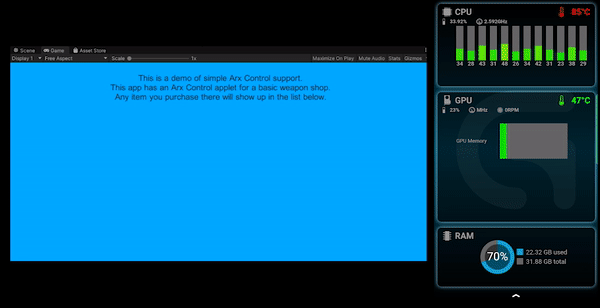

# UniG
A better Unity wrapper for various Logitech G SDKs.

Currently supported SDKs:
* Arx Control ([demo](https://github.com/githubcatw/UniG/tree/master/Assets/UniG/Demo/Arx) | [applet](https://github.com/githubcatw/UniG/tree/master/Assets/StreamingAssets/ArxShopApplet))
  
* LED ([demo](https://github.com/githubcatw/UniG/tree/master/Assets/UniG/Demo/Led))

**Disclaimer: UniG isn't affiliated with Logitech. All rights reserved.**
